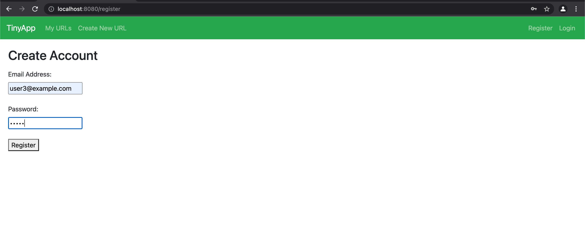
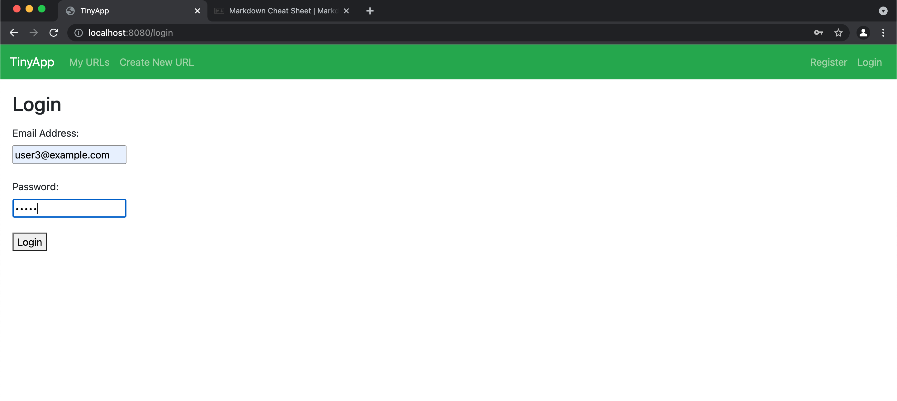
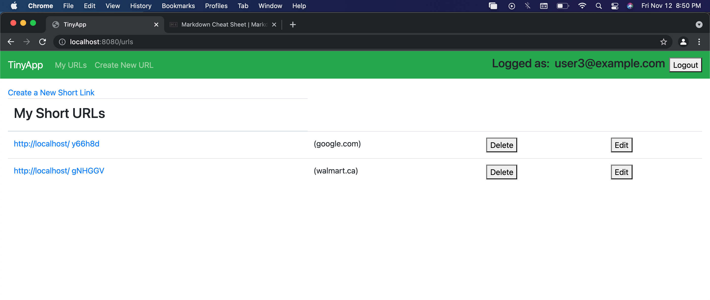
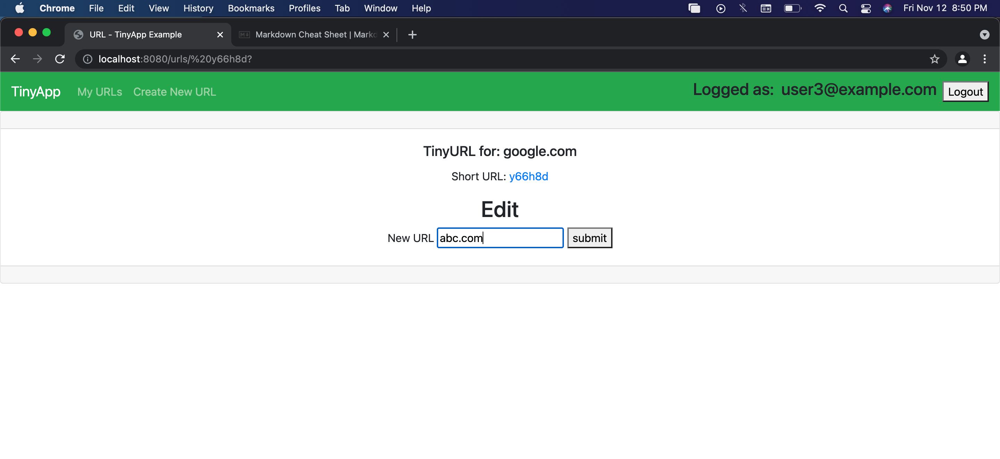

# TinyApp Project

TinyApp is a full stack web application built with Node and Express that allows users to shorten long URLs (à la bit.ly).

## Final Product

- Register page allow new user to register.

- Login Page which allow user to login if registerd.

- Displays short URLs corresponding to Long URLs alonwith options to Delete and Edit URLs.

- Allows user to edit longURL for a given shortURL.

- There are many validation checks also that displays errors when unauthenticated user tries to make changes.

## Dependencies

- Node.js
- Express
- EJS
- bcrypt
- body-parser
- cookie-session

## Getting Started

- Install all dependencies (using the `npm install` command).
- Run the development web server using the `node express_server.js` command.